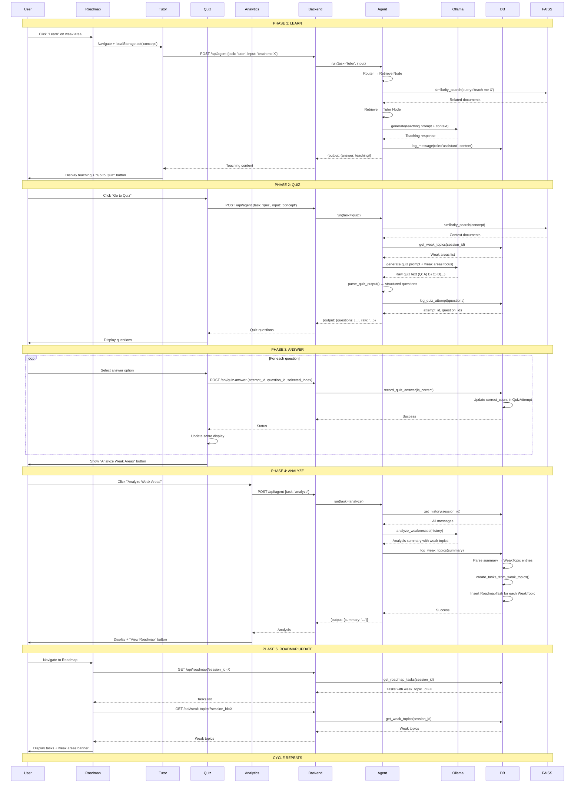
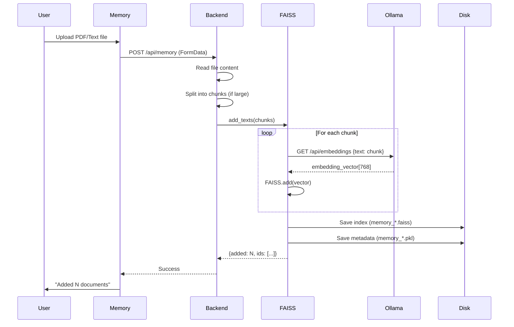
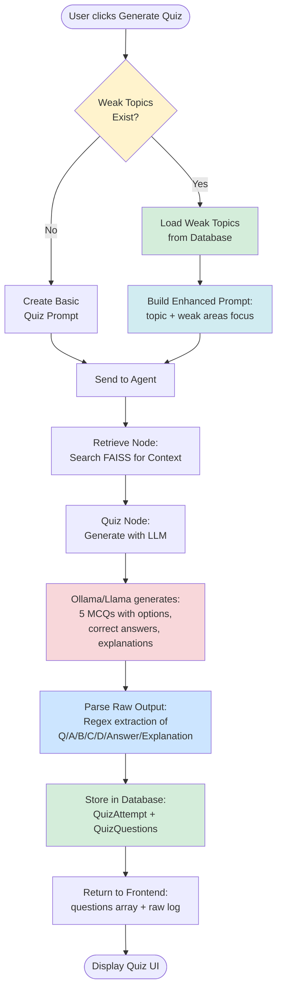
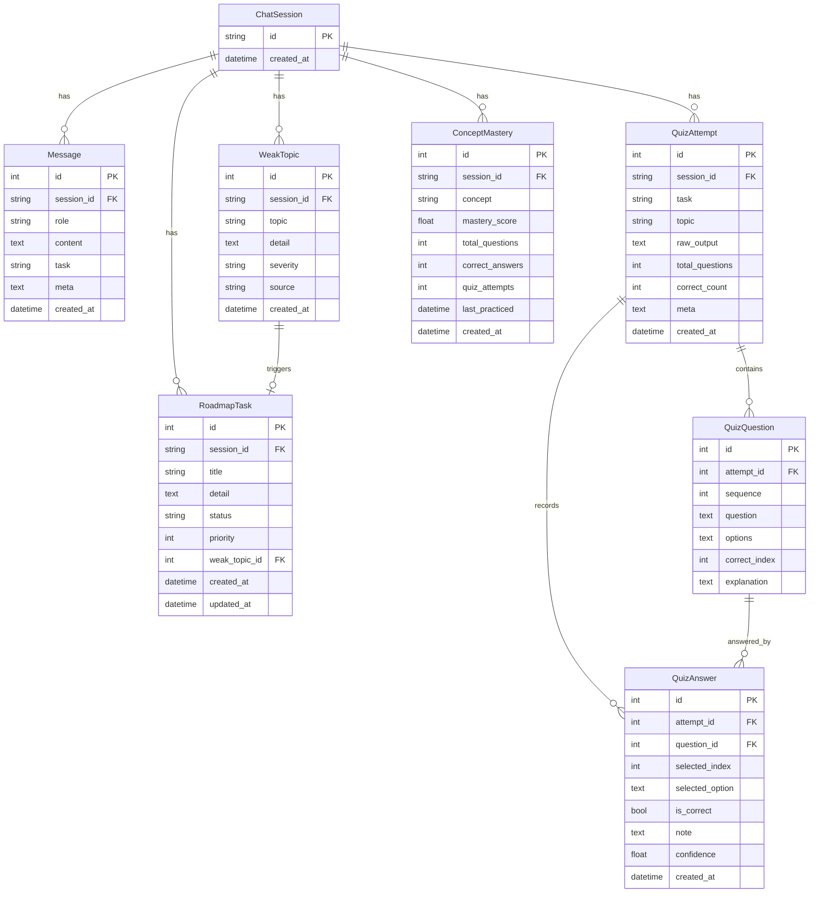
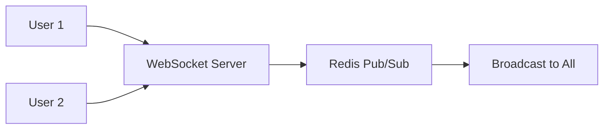

# Agentic Study Buddy - Technical Architecture

## System Architecture Diagram

```mermaid
graph TB
    subgraph "Frontend Layer - React + TypeScript + Vite"
        UI[User Interface]
        subgraph "Pages"
            Tutor[Tutor Page<br/>Chat Interface]
            Quiz[Quiz Page<br/>MCQ Generator]
            Analytics[Analytics Page<br/>Weak Area Analysis]
            Roadmap[Roadmap Page<br/>Task Management]
            Memory[Memory Page<br/>Document Upload]
        end
        
        subgraph "State Management"
            LocalStorage[localStorage<br/>Session Persistence]
            ReactState[React State Hooks<br/>useState, useEffect]
        end
        
        subgraph "API Client"
            APIFunctions[api.ts<br/>Fetch Wrappers]
        end
    end
    
    subgraph "Network Layer"
        HTTP[HTTP/REST<br/>JSON Payloads<br/>CORS Enabled]
        WS[Future: WebSocket<br/>Real-time Updates]
    end
    
    subgraph "Backend Layer - FastAPI + Python"
        subgraph "API Endpoints"
            Health[/api/health]
            AgentEndpoint[/api/agent<br/>Main Entry Point]
            MemoryEndpoint[/api/memory<br/>Document Ingestion]
            HistoryEndpoint[/api/history]
            WeakTopicsEndpoint[/api/weak-topics]
            RoadmapEndpoint[/api/roadmap]
            QuizEndpoint[/api/quiz-answer]
            LearnStart[/api/learn/start]
            LearnQuiz[/api/learn/quiz]
            LearnAnalyze[/api/learn/analyze]
            MasteryEndpoint[/api/mastery]
        end
        
        subgraph "Core Agent System - LangGraph"
            StudyAgent[StudyAgent<br/>State Machine]
            
            subgraph "Agent Nodes"
                Retrieve[Retrieve Node<br/>Vector Search]
                TutorNode[Tutor Node<br/>Q&A Generation]
                QuizNode[Quiz Node<br/>MCQ Generation]
                AnalyzeNode[Analyze Node<br/>Weakness Detection]
                RoadmapNode[Roadmap Node<br/>Study Plan]
                QuestionsNode[Questions Node<br/>Practice Gen]
            end
            
            Router[Task Router<br/>Conditional Edges]
        end
        
        subgraph "Orchestrators"
            AgenticOrch[AgenticOrchestrator<br/>Quiz Performance<br/>Next Action Logic]
            LearnOrch[LearnOrchestrator<br/>Learn→Quiz→Analyze<br/>Mastery Tracking]
        end
        
        subgraph "LLM Integration"
            OllamaClient[OllamaClient<br/>HTTP API Client]
            Llama[Ollama Runtime<br/>llama3.2 Model<br/>Local Inference]
        end
        
        subgraph "Memory System"
            FAISSMemory[FAISSMemory<br/>Vector Store]
            Embeddings[Text Embeddings<br/>Ollama Embed]
            VectorDB[(FAISS Index<br/>Similarity Search)]
        end
        
        subgraph "Data Persistence"
            Storage[Storage Layer<br/>SQLAlchemy ORM]
            
            subgraph "Database Tables"
                ChatSession[(ChatSession)]
                Message[(Message)]
                WeakTopic[(WeakTopic)]
                QuizAttempt[(QuizAttempt)]
                QuizQuestion[(QuizQuestion)]
                QuizAnswer[(QuizAnswer)]
                RoadmapTask[(RoadmapTask)]
                ConceptMastery[(ConceptMastery<br/>NEW)]
            end
            
            SQLite[(SQLite DB<br/>chat.db)]
        end
    end
    
    subgraph "External Services"
        OllamaService[Ollama Server<br/>Port 11434<br/>LLM Serving]
    end
    
    %% Frontend to API
    UI --> Tutor
    UI --> Quiz
    UI --> Analytics
    UI --> Roadmap
    UI --> Memory
    
    Tutor --> APIFunctions
    Quiz --> APIFunctions
    Analytics --> APIFunctions
    Roadmap --> APIFunctions
    Memory --> APIFunctions
    
    ReactState --> LocalStorage
    LocalStorage -.Session ID.-> APIFunctions
    
    APIFunctions --> HTTP
    
    %% Network to Backend
    HTTP --> Health
    HTTP --> AgentEndpoint
    HTTP --> MemoryEndpoint
    HTTP --> HistoryEndpoint
    HTTP --> WeakTopicsEndpoint
    HTTP --> RoadmapEndpoint
    HTTP --> QuizEndpoint
    HTTP --> LearnStart
    HTTP --> LearnQuiz
    HTTP --> LearnAnalyze
    HTTP --> MasteryEndpoint
    
    %% API to Core Systems
    AgentEndpoint --> StudyAgent
    MemoryEndpoint --> FAISSMemory
    LearnStart --> LearnOrch
    LearnQuiz --> LearnOrch
    LearnAnalyze --> LearnOrch
    
    %% Agent Graph Flow
    StudyAgent --> Router
    Router --> Retrieve
    Retrieve --> TutorNode
    Retrieve --> QuizNode
    Retrieve --> AnalyzeNode
    Retrieve --> RoadmapNode
    Retrieve --> QuestionsNode
    
    %% Agent to Services
    TutorNode --> OllamaClient
    QuizNode --> OllamaClient
    AnalyzeNode --> OllamaClient
    RoadmapNode --> OllamaClient
    QuestionsNode --> OllamaClient
    
    Retrieve --> FAISSMemory
    
    %% Orchestrators
    AgentEndpoint --> AgenticOrch
    AgenticOrch --> StudyAgent
    LearnOrch --> StudyAgent
    LearnOrch --> Storage
    
    %% LLM Integration
    OllamaClient --> OllamaService
    
    %% Memory System
    FAISSMemory --> Embeddings
    Embeddings --> OllamaService
    FAISSMemory --> VectorDB
    
    %% Data Flow
    StudyAgent --> Storage
    Storage --> SQLite
    
    SQLite --> ChatSession
    SQLite --> Message
    SQLite --> WeakTopic
    SQLite --> QuizAttempt
    SQLite --> QuizQuestion
    SQLite --> QuizAnswer
    SQLite --> RoadmapTask
    SQLite --> ConceptMastery
    
    %% Read Operations
    HistoryEndpoint --> Storage
    WeakTopicsEndpoint --> Storage
    RoadmapEndpoint --> Storage
    MasteryEndpoint --> Storage
    
    %% Write Operations
    QuizEndpoint --> Storage
    
    %% Styling
    classDef frontend fill:#e1f5ff,stroke:#0288d1,stroke-width:2px
    classDef backend fill:#fff3e0,stroke:#f57c00,stroke-width:2px
    classDef llm fill:#f3e5f5,stroke:#7b1fa2,stroke-width:2px
    classDef storage fill:#e8f5e9,stroke:#388e3c,stroke-width:2px
    classDef network fill:#fce4ec,stroke:#c2185b,stroke-width:2px
    
    class Tutor,Quiz,Analytics,Roadmap,Memory,UI,ReactState,LocalStorage,APIFunctions frontend
    class StudyAgent,Router,TutorNode,QuizNode,AnalyzeNode,RoadmapNode,QuestionsNode,Retrieve,AgenticOrch,LearnOrch,Health,AgentEndpoint,MemoryEndpoint,HistoryEndpoint,WeakTopicsEndpoint,RoadmapEndpoint,QuizEndpoint,LearnStart,LearnQuiz,LearnAnalyze,MasteryEndpoint backend
    class OllamaClient,Llama,OllamaService,Embeddings llm
    class Storage,SQLite,ChatSession,Message,WeakTopic,QuizAttempt,QuizQuestion,QuizAnswer,RoadmapTask,ConceptMastery,FAISSMemory,VectorDB storage
    class HTTP,WS network
```

## Data Flow Diagrams

### 1. Learning Flow (Complete Cycle)



### 2. Memory Ingestion Flow



### 3. Quiz Generation with Weak Area Focus



### 4. Mastery Tracking Algorithm

```mermaid
flowchart LR
    subgraph Input
        QuizComplete[Quiz Completed]
        Concept[Concept Name]
        Correct[Correct Answers]
        Total[Total Questions]
    end
    
    subgraph "Database Check"
        Query[Query ConceptMastery<br/>WHERE session_id & concept]
        Exists{Entry<br/>Exists?}
    end
    
    subgraph "Update Logic"
        UpdateExisting[Existing Entry:<br/>total_questions += Total<br/>correct_answers += Correct<br/>quiz_attempts += 1]
        
        CreateNew[New Entry:<br/>total_questions = Total<br/>correct_answers = Correct<br/>quiz_attempts = 1]
    end
    
    subgraph "Mastery Calculation"
        CalcAccuracy[Accuracy =<br/>correct_answers / total_questions * 100]
        
        CalcConfidence[Confidence Factor =<br/>min(quiz_attempts / 5, 1.0)]
        
        CalcMastery[Mastery Score =<br/>Accuracy × Confidence Factor]
    end
    
    subgraph Output
        SaveDB[Save to Database]
        
        Status{Mastery<br/>Score?}
        
        Status -->|≥ 90| Mastered[Status: MASTERED ✅]
        Status -->|70-89| Proficient[Status: PROFICIENT 👍]
        Status -->|50-69| Learning[Status: LEARNING 📚]
        Status -->|< 50| NeedsPractice[Status: NEEDS PRACTICE ⚠️]
    end
    
    QuizComplete --> Query
    Concept --> Query
    Correct --> Query
    Total --> Query
    
    Query --> Exists
    
    Exists -->|Yes| UpdateExisting
    Exists -->|No| CreateNew
    
    UpdateExisting --> CalcAccuracy
    CreateNew --> CalcAccuracy
    
    CalcAccuracy --> CalcConfidence
    CalcConfidence --> CalcMastery
    
    CalcMastery --> SaveDB
    SaveDB --> Status
    
    Mastered --> Return([Return Mastery Data])
    Proficient --> Return
    Learning --> Return
    NeedsPractice --> Return
    
    style CalcMastery fill:#ffd700
    style Mastered fill:#28a745
    style Proficient fill:#17a2b8
    style Learning fill:#ffc107
    style NeedsPractice fill:#dc3545
```

## Technology Stack

### Frontend
- **Framework**: React 18
- **Language**: TypeScript
- **Build Tool**: Vite 5
- **Routing**: React Router DOM v6
- **State Management**: React Hooks (useState, useEffect)
- **Storage**: localStorage (Session Persistence)
- **HTTP Client**: Fetch API
- **Styling**: CSS3 (styles.css)

### Backend
- **Framework**: FastAPI (Python 3.9+)
- **ASGI Server**: Uvicorn
- **Agent Framework**: LangGraph (StateGraph)
- **ORM**: SQLAlchemy
- **Database**: SQLite
- **Vector Store**: FAISS (Facebook AI Similarity Search)
- **LLM Client**: Custom Ollama HTTP Client

### AI/ML
- **LLM**: Ollama Runtime
- **Model**: llama3.2 (Local Inference)
- **Embeddings**: Ollama Embeddings API
- **Vector Dimensions**: 768 (model-dependent)

### DevOps
- **Process Management**: bash scripts (start.sh)
- **Ports**: 
  - Backend: 8001
  - Frontend: 5173
  - Ollama: 11434

## Database Schema



## Future Enhancements

### 1. Real-time Collaboration


### 2. Advanced Analytics Dashboard
- Performance metrics over time
- Concept mastery heatmap
- Learning velocity tracking
- Spaced repetition recommendations

### 3. Multi-Modal Learning
- Image-based questions
- Audio explanations
- Video content integration
- Interactive code execution

### 4. Social Features
- Study groups
- Peer comparison (anonymous)
- Shared roadmaps
- Collaborative quizzes

### 5. Mobile App
- React Native or Flutter
- Offline mode with sync
- Push notifications for study reminders
- Voice interaction

### 6. Enhanced Memory
- Hierarchical document organization
- Multi-vector retrieval (dense + sparse)
- Document chunking strategies
- Citation tracking

### 7. Advanced Orchestration
- Multi-agent debate (different teaching styles)
- Curriculum generation
- Difficulty adaptation
- Learning style detection

## API Reference

### Core Endpoints

| Method | Endpoint | Purpose | Request Body | Response |
|--------|----------|---------|--------------|----------|
| GET | `/api/health` | Health check | - | `{status: "ok"}` |
| POST | `/api/agent` | Main agent interaction | `{task, input, history, session_id}` | `{task, output, meta, session_id}` |
| POST | `/api/memory` | Upload documents | `FormData{texts[], file}` | `{added, ids}` |
| GET | `/api/history` | Get chat history | `?session_id=X` | `{session_id, messages[]}` |
| GET | `/api/weak-topics` | Get weak areas | `?session_id=X` | `{session_id, weak_topics[]}` |
| GET | `/api/roadmap` | Get learning tasks | `?session_id=X` | `{session_id, tasks[]}` |
| POST | `/api/roadmap/task-status` | Update task | `{session_id, task_id, status}` | `{status: "ok"}` |
| POST | `/api/quiz-answer` | Submit answer | `{session_id, attempt_id, question_id, selected_index, is_correct}` | `{status: "ok"}` |
| GET | `/api/analysis` | Get latest analysis | `?session_id=X` | `{session_id, summary}` |
| GET | `/api/quiz-history` | Get quiz attempts | `?session_id=X` | `{session_id, quiz_history[]}` |
| GET | `/api/recommendations` | AI recommendations | `?session_id=X` | `{next_action, performance}` |

### Learn Orchestration Endpoints

| Method | Endpoint | Purpose | Request Body | Response |
|--------|----------|---------|--------------|----------|
| POST | `/api/learn/start` | Start learning concept | `{session_id, concept}` | `{phase: "learn", teaching, next_action}` |
| POST | `/api/learn/quiz` | Generate concept quiz | `{session_id, concept, focus_weak_areas}` | `{phase: "quiz", questions[], attempt_id}` |
| POST | `/api/learn/analyze` | Analyze quiz results | `{session_id, attempt_id, concept}` | `{phase: "analyze", mastery, analysis, needs_practice}` |
| GET | `/api/learn/progress` | Get learning progress | `?session_id=X&concept=Y` | `{concept, status, mastery}` |
| GET | `/api/mastery` | Get all masteries | `?session_id=X` | `{session_id, masteries[]}` |

## Performance Considerations

### Optimization Strategies
1. **Vector Search**: FAISS IndexFlatL2 for < 10k docs, IndexIVFFlat for larger
2. **LLM Caching**: Cache frequent prompts/responses
3. **Database Indexing**: Indexes on session_id, created_at
4. **Lazy Loading**: Load history/weak topics on demand
5. **Batch Operations**: Batch quiz answer submissions

### Scalability Paths
1. **Horizontal**: Multiple FastAPI workers (Gunicorn + Uvicorn)
2. **Database**: Migrate to PostgreSQL for production
3. **Vector Store**: Migrate to Pinecone/Weaviate for scale
4. **LLM**: Support for OpenAI/Anthropic APIs
5. **Caching**: Redis for session/response caching

## Key Design Patterns

1. **State Machine**: LangGraph for agent workflow
2. **Repository Pattern**: Storage class abstracts DB operations
3. **Factory Pattern**: Agent node creation
4. **Observer Pattern**: React state updates
5. **Orchestrator Pattern**: LearnOrchestrator manages multi-phase flows
6. **Singleton Pattern**: Storage, Memory instances
